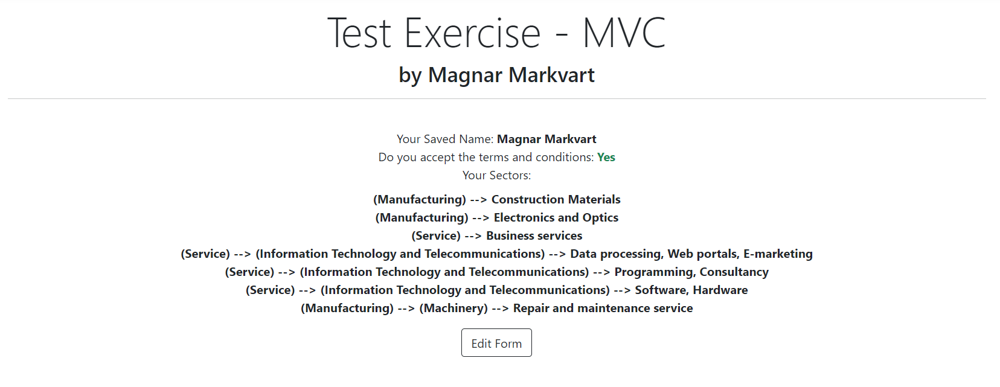
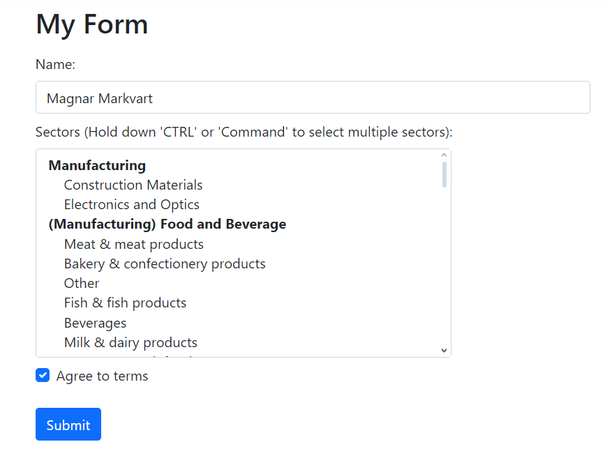
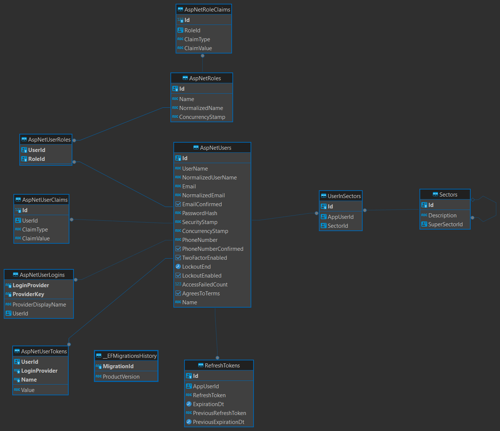

# TestExercise for Junior Software Engineer application 2024-05-14

Welcome to my project! In this ASP.NET MVC application, I've crafted a simple and easy to follow user experience
using Razor as a Server-Side view engine to generate dynamic content for my frontend. Users can effortlessly register,
login, and edit their form data. Also I've crafted a view to read saved form data and display it in a readable manner.
 

## Personal Details
<b>Name:</b> Magnar Markvart  
<b>University:</b> TalTech  
<b>E-Mail:</b> mmmagnar@gmail.com

## Application Details
* Database: Postgres
* Project: ASP.NET Core MVC
* Frontend: Razor views

### Functionality (Tasks)
* Sectors which have specified subsectors are not selectable in the form, rather user has to select a more specific section
* All input data is validated and is required to save the form, including agreeing to terms
* All input data is stored in a database and form is filled with the existing data if it exists
* Users are able to edit their form data as many times as they like.
* Admin users can add additional sectors and subsectors and can set all users in additional sectors in the admin area

### Initial Startup
* Run docker-compose.yml file to create a docker container for postgres database.
  (Make sure the external port is not in use already)
* Run the container
* Should be good to go - migrations are applied from code and are included in this repository

### Seeded Data
Initial data will be seeded at first runtime.
#### That Includes:
* Admin User
* Sectors data

### Admin User (For testing)
<b>E-Mail / Username:</b> admin@admin.ee  
<b>Password:</b> Admin.123

### Extra functionality / Future Development
This exercise is solved so that it would prove a good base for future development:
* JWT support for Web Development, including token refreshing, validating, invalidating (Currently cookie based auth)
* Base interfaces and entities with generics for future adaptability
* Unit of work pattern implemented
* Admin Area for system administrators with MVC CRUD controllers for creating extra sectors if needed and setting users in sectors